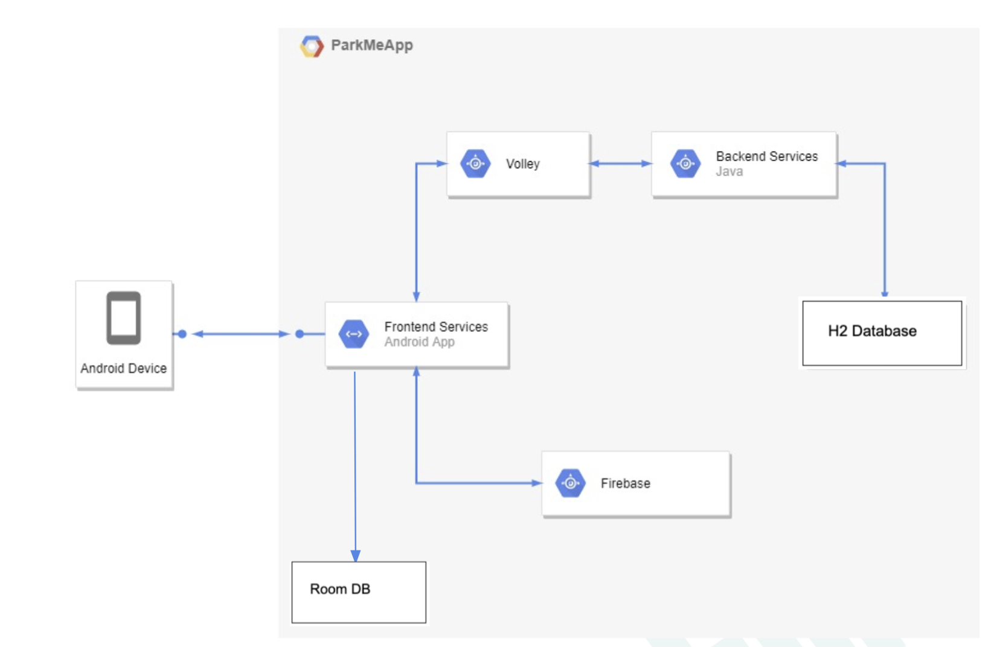
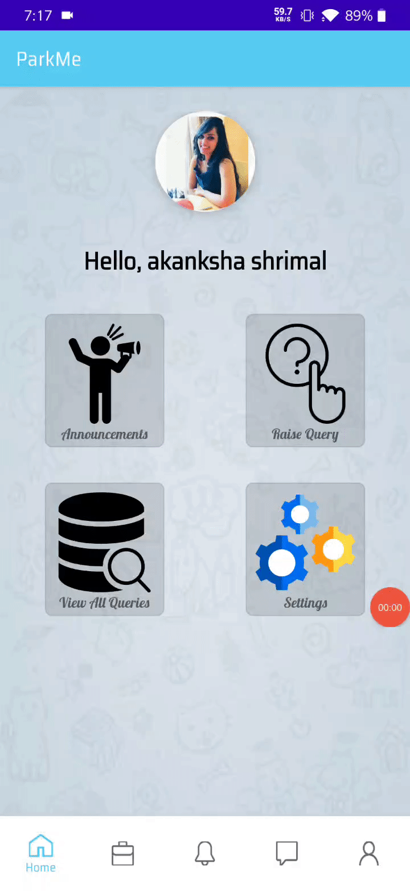

# ParkMe-Parking-Management-Android-Application

## Table of Contents

| No |   Title   |  
| :--- | :----------------------: | 
| 1. |   [Project Overview](#Project-Overview) |   
| 2. |   [Project Demo](#Project-Demo) |   
| 3. |[Functionalities](#Functionalities)|   
| 4.  |  [Methodology](#Methodology)  | 
| 5.  |    [References](#References)   | 
| 6.  |    [Project Team Members](#Project-Team-Members)   | 

## Project Overview

This project is done as a part of `Mobile Computing Course` Course.

We developed a parking management app : ParkMe to solve following problems related to parking space management. 
- Vehicles parked in a haphazard manner, making it difficult to use parking space efficiently.
- Two wheelers packed in four-wheeler space.
- Vehicles parked in no-parking spaces.
- Vehicles parked in other’s parking spaces.
- Looking for empty parking spaces. 
  
Our app will provide a common solution to all these problems by enabling user to :- 
- Communicate with wrongly parked vehicle owners and ask to re-park. 
- Send push notifications 
- Chat instantly, if required
- Penalize officials or locals by society or corporation.
- Look for empty parking spaces around. 
  

&nbsp;

Project Poster can be found in [MC-Poster-midterm.pdf](MC-Poster-midterm.pdf) and [MC-Poster-endterm.pdf](MC-Poster-endterm.pdf). 

Project Report can be found in [MC_Project_EndTerm_Report.pdf](MC_Project_EndTerm_Report.pdf).

## Project Demo

                                   Fig 1. Architecture Implemented 

                                   Fig 2.Raise Query, Push Notification and Chat Functionality

 <table>
  <tr>
    <td>Raise Query</td>
     <td>Push Notification</td>
     <td>Chat Functionality</td>
  </tr>
  <tr>
    <td></td>
    <td></td>
    <td></td>
  </tr>
 </table>  

                                   Fig 3.Announcement, Resolve Query  and Settings Page

 <table>
  <tr>
    <td>Announcement</td>
     <td>Resolve Query</td>
     <td>Settings Page</td>
  </tr>
  <tr>
    <td></td>
    <td></td>
    <td></td>
  </tr>
 </table>  

&nbsp;

## Functionalities
- **RAISE QUERY** :-
    User will be able to raise a query to the intended user, by capturing the vehicle number and
    ML model will detect the text on the number plate. User specifies the reason, parking space
    and query type and query is automatically raised to the respective user. If no such user with
    the same number plate is registered with the society, the query is directly raised to admin.
- **PUSH NOTIFICATION** :-
    Once a query is raised, a push notification is sent to the intended user with all other details.
    On clicking the push notification, the user can see all the details and even chat with other
    users.
- **CHAT FUNCTIONALITY** :-
    A chat interface between two users.
- **ANNOUNCEMENTS**:-
    A message can be delivered to all users using the particular app.
- **QUERY RESOLVING** :-
    The user can look into queries raised by him or queries raised to him. He can even resolve
    the query when the work is done.
- **USER RATING** :-
    On resolving the queries, users will be asked to rate the other users and a rating will be
    displayed for each and every user over the interface. This rating can then be used by the
    society to reward/penalize the users.
- **FIND SLOTS** :-
    Our application also provides flexibility to search empty parking spaces available in the
    society.
- **LOGIN** :-
    A login functionality with all checks.
- **FORGOT PASSWORD** :-
    Forgot password functionality.
- **CHANGE PASSWORD** :-
    change password functionality.
- **VIEW QUERY AND CHATS** :-
    Users can view all queries raised by him/to him along with all the chats.
- **PROFILE AND SETTING** :-
    A profile and settings page. Admin can be contacted through the settings page.
- **LOGOUT** :-
    A logout functionality.

## Methodology
- RAISE QUERY
   - ML model of 'text recognition' used from FireBase and integrated with android. 
   - With vehicle number mapping of user, query is sent to other user via push notifications using token of the user from database.
    

- PUSH NOTIFICATION
  - Push Notifications [using FireBase cloud messaging app](https://medium.com/nybles/sending-push-notifications-by-using-firebase-cloud-messaging-249aa34f4f4c). For each user, a special token generated and mapped to that user in the database. 
  From vehicle number other user token found in database, through which notifications are sent by FireBase. 

- CHAT FUNCTIONALITY
  - Chat functionality using recycler view and chats saved using room database and H2 database.
  - Used Java Rx library for chats.
    
- ANNOUNCEMENTS
  -  For sending FCM message to a group of devices, all such devices need to subscribe to a common topic. So all users belonging to a particular organization are subscribed to a common topic which act as mailing list from where announcements can be sent. 
       
- USER RATING
  - Using RatingBar library in android. 

- FORGOT PASSWORD
  - Using JavaMailSender Library new password sent to user via email and also saved in database.
    
- Session management using shared preferences. 
    
    
## References

1. [Firebase Google Cloud Messaging](https://firebase.google.com/docs/cloud-messaging)
2. [Text Recognition using Firebase](https://firebase.google.com/docs/ml-kit/recognize-text) 

## Project Team Members

1. Akanksha Shrimal
2. Shivam Sharma 
3. Shraddha Sablok  
4. Akhil Mahajan
  

